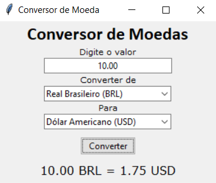

## Conversor de Moedas

Conversor de moedas com interface gráfica interativa, desenvolvido em Python usando Tkinter



#### Funcionalidades

- Conversão em tempo real entre diferentes moedas
- Suporte para as seguintes moedas:
  - Dólar Americano (USD)
  - Real Brasileiro (BRL)
  - Euro (EUR)
  - Libra Esterlina (GBP)
  - Franco Suíço (CHF)

#### Tecnologias Utilizadas

- Python 3.11
- Tkinter (interface gráfica)
- Requests (consumo de API)
- [AwesomeAPI](https://docs.awesomeapi.com.br/) para cotações em tempo real

#### Instalação

1. Clone o repositório:
```bash
git clone https://github.com/renan-git/conversor-moeda.git
```

2. Instale as dependências:
```bash
pip install requests
```
3. Execute o programa:
```bash
python main.py
```
#### Como Usar
- Digite o valor a ser convertido no campo "Digite o valor"
- Selecione a moeda de origem no campo "Converter de"
- Selecione a moeda de destino no campo "Para"
- Clique no botão "Converter"
- O resultado será exibido na parte inferior da janela

#### Observações
- O valor deve ser inserido utilizando ponto (.) como separador decimal
- Não é possível converter uma moeda para ela mesma
- É necessária conexão com a internet para obter as cotações atualizadas